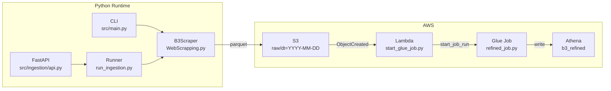
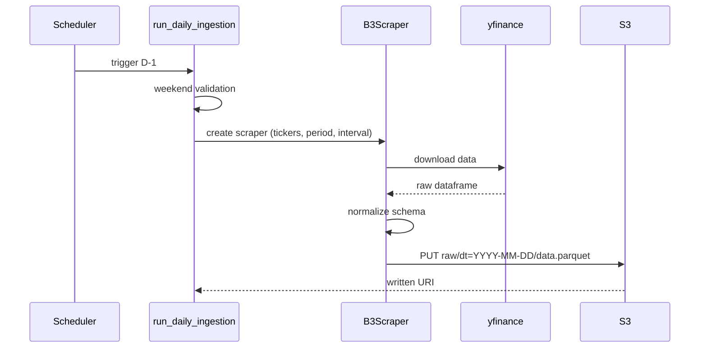
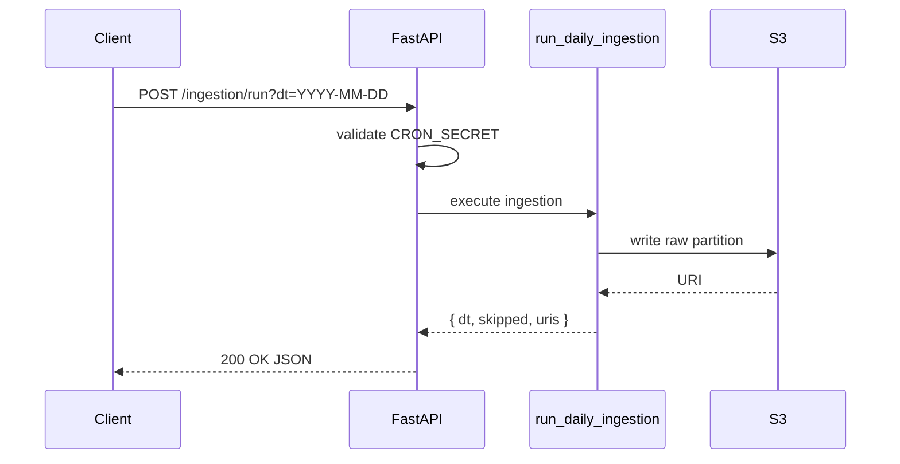
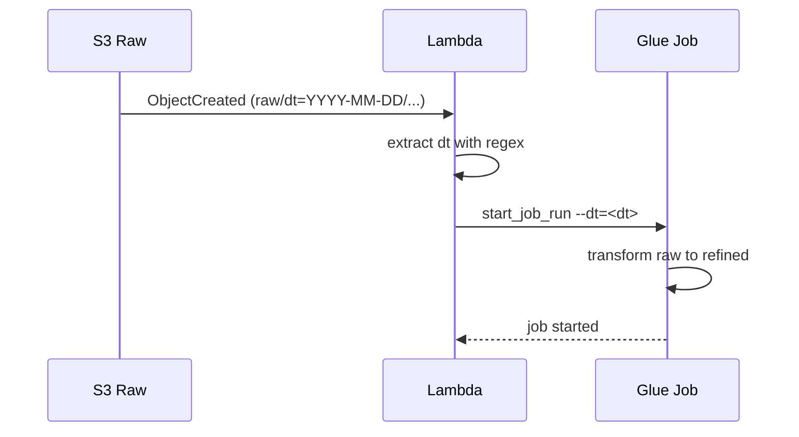

# B3 Aviation & Aerospace Market Data Pipeline

Targeted data engineering pipeline dedicated to Brazilian aviation and aerospace stocks listed on B3. Automates ingestion, normalization, and transformation of market data to support sector-specific financial analysis and investment research.

[](https://python.org)
[](https://fastapi.tiangolo.com)
[](https://aws.amazon.com)
[](https://parquet.apache.org)
[](https://aws.amazon.com/athena/)
[](LICENSE)

## Overview

System for collecting and processing B3 quotes with emphasis on reliability, partition idempotency, and low operational cost.

- Daily ingestion via `yfinance`, partitioned by date (`dt`)
- Raw Parquet storage in S3
- Event-driven orchestration (`S3 -> Lambda -> Glue`)
- Refined layer queryable via Amazon Athena
- REST API for manual trigger and reprocessing

## Architecture



## Main Flows

### Daily ingestion (D-1)



### Manual trigger via API



### S3 event to Glue



## Repository Structure

```text
.
|-- src/
|   |-- ingestion/
|   |   |-- api.py                 # FastAPI endpoints
|   |   |-- run_ingestion.py       # Daily ingestion orchestration
|   |   |-- WebScrapping.py        # B3Scraper (yfinance)
|   |   `-- lambda_function.py     # Ingestion Lambda
|   |-- lambda/
|   |   `-- start_glue_job.py      # Lambda that triggers Glue
|   |-- glue/
|   |   `-- refined_job.py         # Pending implementation
|   `-- main.py                    # CLI entrypoint
|-- sql/
|   `-- athena_request.sql         # Reference refined query
`-- README.md
```

## Data Schema

### Raw layer: `s3://<bucket>/<prefix>/dt=YYYY-MM-DD/data.parquet`

| Column | Type | Description |
|--------|------|-------------|
| `date` | `timestamp` | Quote date/time |
| `ticker` | `string` | Asset code |
| `open` | `float64` | Open price |
| `high` | `float64` | High price |
| `low` | `float64` | Low price |
| `close` | `float64` | Close price |
| `adj_close` | `float64` | Adjusted close |
| `volume` | `int64` | Traded volume |

### Refined layer: `Athena table b3_refined` (partition key `dt`)

| Column | Type | Description |
|--------|------|-------------|
| `dt` | `date` | Partition key |
| `ticker` | `string` | Asset code |
| `volume_total_dia` | `int64` | Daily aggregated volume |
| `mm7_preco` | `float64` | 7-day moving average price |

Note: the refined layer still depends on implementation of `src/glue/refined_job.py`.

## How To Run

### Prerequisites

- Python 3.11+
- AWS credentials configured (`~/.aws/credentials` or environment variables)
- S3 bucket created and accessible

### Installation

```bash
pip install -r requirements.txt
```

### CLI ingestion

```bash
python src/main.py --tickers GOLL4,AZUL4 --period 1mo --s3-bucket your-bucket --s3-prefix raw --dt 2026-02-20
```

### API ingestion

```bash
# start server
uvicorn src.ingestion.api:app --reload

# trigger ingestion
curl -X POST "http://localhost:8000/ingestion/run?dt=2026-02-20" \
  -H "X-Cron-Secret: your_secret"
```

### Backfill Jan/Feb to raw and trigger refined

Using API:

```bash
curl -X POST "http://localhost:8000/ingestion/backfill?start=2026-01-01&end=2026-02-28&trigger_refined=true" \
  -H "X-Cron-Secret: your_secret"
```

Using Lambda event payload:

```bash
aws lambda invoke \
  --function-name your-ingestion-lambda \
  --payload fileb://config/events/backfill_jan_feb_2026.json \
  response.json
```

## Environment Variables

| Variable | Description | Required |
|----------|-------------|----------|
| `AWS_BUCKET` | S3 bucket for CLI mode (`src/main.py`) | Conditional |
| `S3_BUCKET` | S3 bucket for runner/API/Lambda ingestion | Conditional |
| `RAW_PREFIX` | Base prefix in S3 (default `raw`) | No |
| `TICKERS` | Comma-separated tickers | No |
| `CRON_SECRET` | Secret used by `POST /ingestion/run` | No |
| `GLUE_JOB_NAME` | Glue job name used to start refined processing | Yes (for refined trigger) |
| `RAW_BUCKET` | Legacy Lambda bucket variable | Legacy only |

## Non-Functional Requirements

| Category | Requirement |
|----------|-------------|
| Reliability | Skip weekends, fail explicitly on missing data, controlled overwrite by `dt` |
| Idempotency | Re-running for the same `dt` overwrites the same partition |
| Observability | Structured logs with `dt`, `ticker_count`, `rows_ingested`, `latency_ms` |
| Security | `CRON_SECRET` via env, no hardcoded credentials, least-privilege IAM |
| Cost | Parquet plus date partitioning, one file/day, short default period (`5d`) |

## Known Risks

| Risk | Mitigation |
|------|------------|
| `yfinance` may return empty or unstable data | Retries with backoff and alerts on failure |
| Quote schema drift | Validate schema before writing to S3 |
| Invalid S3 key parsing may block Glue trigger | Strict key validation and event logging |
| Duplicate Lambda implementations in repo | Define official flow and deprecate legacy files |

## Roadmap

- [x] Implement `src/glue/refined_job.py` with business transformations and `b3_refined` writes
- [x] Add unit tests for normalization and date selection logic
- [x] Add CI/CD with lint, tests, and dependency security checks
- [x] Publish operation runbook (backfill, rollback, troubleshooting)

## Architectural Decisions

| ID | Decision | Pros | Cons |
|----|----------|------|------|
| ADR-01 | Use `yfinance` as source | Fast implementation | No enterprise SLA |
| ADR-02 | Store raw data in Parquet on S3 | Low cost, efficient reads | Schema governance discipline required |
| ADR-03 | Use `S3 -> Lambda -> Glue` flow | On-demand processing | Higher operational complexity |
| ADR-04 | Expose API for manual triggers | Operational flexibility | Requires auth and rate limiting |
