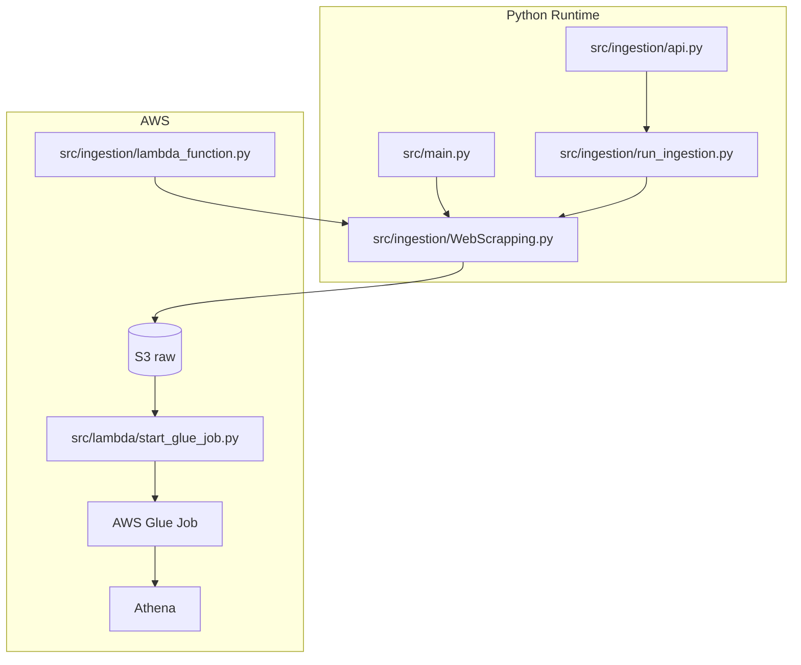
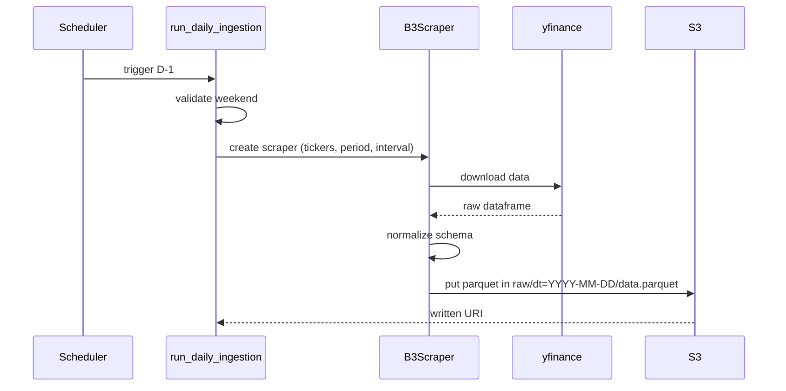
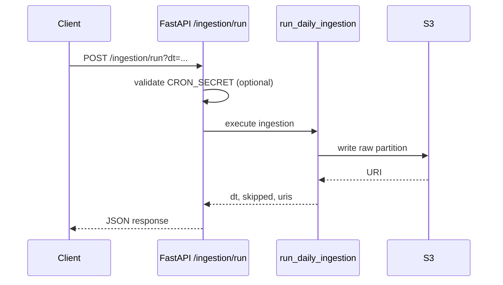
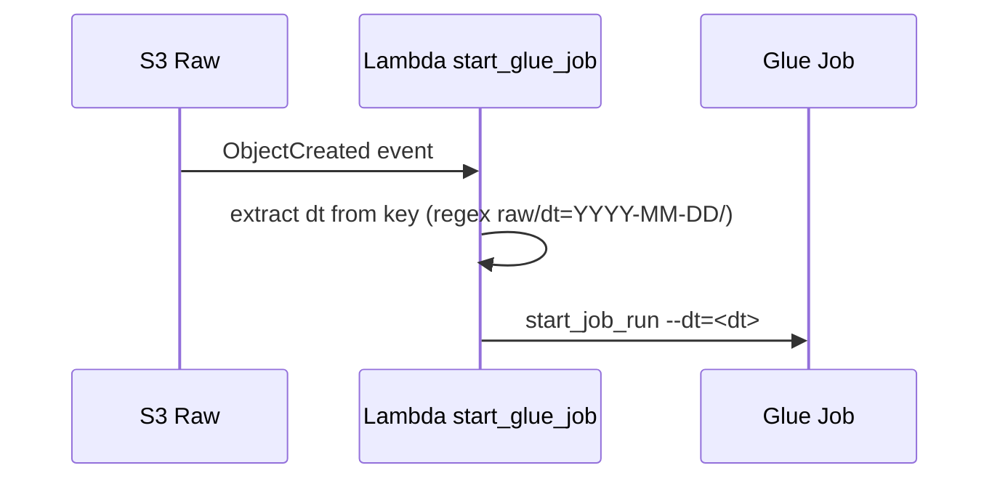

# Software Design

## 1. Context

This system processes B3 market data with a focus on:

- reliable raw data ingestion
- date-based partitioning for efficient queries
- clear separation between ingestion and transformation (raw -> refined)
- orchestration via API and AWS events

## 2. Design Goals

- operational simplicity for daily ingestion (D-1)
- partition idempotency (`dt`)
- low coupling between collection, storage, and transformation
- easy evolution for new tickers and indicators

## 3. Functional Scope

### 3.1 Included

- quote download via `yfinance`
- tabular schema normalization
- Parquet write to S3 (`raw/dt=YYYY-MM-DD`)
- endpoint for manual ingestion trigger
- Lambda that starts Glue job when new raw data arrives

### 3.2 Not included yet

- refined transformation job implementation in Glue (`src/glue/refined_job.py` is empty)
- automated test suite
- declarative CI/CD in this repository

## 4. Component View



## 5. Main Flows

### 5.1 Daily ingestion (scheduled)



### 5.2 Manual trigger via API



### 5.3 S3 event to Glue



## 6. Data Contracts

### 6.1 Raw layer (implemented)

Partition format:

```text
s3://<bucket>/<prefix>/dt=YYYY-MM-DD/data.parquet
```

Standard columns:

- `date`
- `ticker`
- `open`
- `high`
- `low`
- `close`
- `adj_close`
- `volume`

### 6.2 Refined layer (expected)

The query in `sql/athena_request.sql` suggests expected refined columns:

- `dt`
- `ticker`
- `volume_total_dia`
- `mm7_preco`

Proposal: Glue writes table `b3_refined` with these columns and `dt` partitioning.

## 7. Non-Functional Requirements (NFR)

### 7.1 Reliability

- skip weekends to avoid empty partitions
- fail explicitly when no data exists for requested `dt`
- keep controlled overwrite semantics (`data.parquet` per day)

### 7.2 Observability

- structured logs with `dt`, `ticker_count`, `bucket`, `prefix`
- execution identifier per request/lambda invocation
- minimum metrics: `rows_ingested`, `partitions_written`, `ingestion_latency_ms`

### 7.3 Security

- API secret via `CRON_SECRET`
- no hardcoded credentials in code
- least-privilege IAM for S3/Glue

### 7.4 Performance and Cost

- Parquet plus `dt` partitioning
- short `period` for daily flow (default `5d`) to reduce transfer
- avoid too many small files (one file per day in raw)

## 8. Architectural Decisions and Trade-offs

1. Data source: `yfinance`
   - Pro: fast implementation
   - Con: external dependency without enterprise SLA

2. Raw storage in S3 Parquet
   - Pro: low cost and efficient analytical reads
   - Con: schema governance requires discipline

3. Decoupling via S3 event -> Lambda -> Glue
   - Pro: process refined layer only when new raw data exists
   - Con: higher operational complexity than a monolithic flow

4. API for manual trigger
   - Pro: supports reprocessing and assisted operations
   - Con: requires auth and usage controls

## 9. Technical Risks and Mitigations

- Risk: `yfinance` empty or intermittent responses
  - Mitigation: retries with backoff and alerting

- Risk: schema drift in quote fields
  - Mitigation: schema validation before writing raw data

- Risk: Glue not starting due to invalid key parsing
  - Mitigation: robust key validation and error logging with original event

- Risk: duplicate Lambda implementations in repo
  - Mitigation: define one official flow and mark legacy files

## 10. Recommended Evolution Plan

1. Implement `src/glue/refined_job.py` with transformations and writes to `b3_refined`.
2. Add unit tests for normalization and target-date selection functions.
3. Add CI for lint, tests, and dependency security checks.
4. Publish an operations runbook with backfill and rollback procedures.
